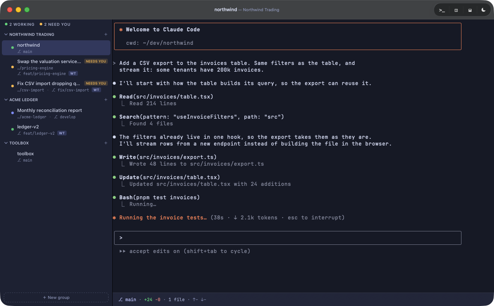

# tkzmux

A native macOS session manager for coding agents: [Claude Code](https://claude.com/claude-code),
[Codex CLI](https://developers.openai.com/codex/cli) and the [Antigravity CLI](https://antigravity.google).
Each conversation gets its own terminal in one window. The sidebar groups sessions by repository,
and each session shows whether it is *working*, *done* or **NEEDS YOU**. Sessions come back after a quit,
with scrollback, and the agent's resume command is one keystroke away.



> A personal project, developed in the open. It is not a supported product: there is no roadmap
> and no compatibility promise.

## Agents

|                       | Claude Code | Codex CLI | Antigravity CLI |
|---|---|---|---|
| Status from hooks     | ✅ | ✅ | ✅ |
| Resume a conversation | ✅ | ✅ | ✅ |
| Usage and context     | ✅ | ✅ | — |
| Several accounts      | ✅ | ✅ | — |

tkzmux only offers the agents it finds on your `PATH`.

## Keyboard

| Keys | |
|---|---|
| ⌘N / ⇧⌘N | New session / new group |
| ⌘F | Search sessions, transcripts and changed files |
| ⇧⌘P | Command palette |
| ⌘T / ⌘D / ⇧⌘D | New terminal / split side by side / split stacked |
| ⌘1…⌘9 | Select a session |

Hold ⌘ for two seconds to see every binding. Details and rebinding: [docs/shortcuts.md](docs/shortcuts.md).

## Install

Requires macOS 26 or later on Apple Silicon, and at least one supported agent.

```sh
brew tap tkz0/tap
brew trust --cask tkz0/tap/tkzmux   # required for third-party taps since Homebrew 6.0
brew install --cask tkzmux
```

For the PR badge, also install and log in to the [GitHub CLI](https://cli.github.com) (`gh`).

## Build from source

```sh
git clone https://github.com/tkz0/tkzmux
cd tkzmux
xcodebuild -downloadComponent MetalToolchain   # once, on Xcode 26
make app && open build/tkzmux.app
```

See [CONTRIBUTING.md](CONTRIBUTING.md) for the dev loop.

## Privacy

tkzmux collects no telemetry. Its only network request of its own is a check for the latest
release on GitHub. It reads the agents' config directories but does not write to them unless you
opt in to an integration, and it asks you first. Terminal snapshots are stored **unencrypted**
under `~/Library/Application Support/tkzmux`, and they are deleted with the session.
For a file-by-file list, see [docs/privacy.md](docs/privacy.md).

## License

MIT. See [LICENSE](LICENSE).

The terminal is built on [libghostty-vt](https://github.com/ghostty-org/ghostty) (MIT). It ships
with [JetBrains Mono](https://github.com/JetBrains/JetBrainsMono) (SIL OFL 1.1). Claude Code,
Codex CLI and Antigravity belong to Anthropic, OpenAI and Google. This project is not affiliated
with any of them.
